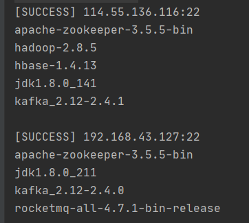

# Xscp — 批量远程复制工具
一个专为运维同学开发的集群维护工具，以增加最少的参数、保持原有命令格式不变的前提下，提供批量复制及执行简单命令行工作

## 场景说明
- 运维同事需要将某个需修改的配置文件复制到集群内所有机器的相同路径下，这时候通常是需要在一台机器上修改好配置文件，然后对逐台机器使用scp命令
- 需要查看集群内所有机器内的某个文件的内容，需要逐个使用`ssh -i /path/to/key root@192.168.1.1` -> `cat /etc/hosts`

## 功能
### 批量远程复制
只用一条命令行将文件分发到所有指定的机器上的相同目录下
`xscp -f /hosts -k /path/to/key -u root srcFile targetPath`

- 参数说明
    
    - -f:  指定每行为ip地址的文件，若ssh服务不在22端口需指明；如192.168.1.1:22
    - -k:  指定ssh私有文件地址
    - -u:  指定用户名
    - srcFile: 本地源文件
    - targetPath: 目的地路径，复制后文件名与源文件名相同
    
- 以环境变量指定参数

    若每次使用时都需要指定-f -k -u等这类不常变化的参数，则势必加大工作量。所以提供以环境变量的形式配置此类参数。若同时存在则命令行上的参数将覆盖环境变量

    ```
    XSCP_HOST_FILE=/path/to/hosts
    XSCP_PRI_KEY=/path/to/key
    XSCP_USERNAME=root
    ```

    在此配置下，批量远程复制命令将简化为`xscp srcFile targetPath`，与本地执行的cp命令完全一致，无需输入额外参数

### 批量执行命令行

有时需查看集群内每台集群上某个配置文件的内容是否正确，或查看路径下文件是否存在等情况。本工具也提供相应功能。

例如：`scp -c ls /home`

将在每台机器上执行`ls /home`命令，再将输出返回到本地，结果如下图所示



## 注意事项

1. 只支持向linux服务器远程复制，可从windows -> linux 和 linux -> linux
2. 对于较复杂的需要交互的命令行暂不提供支持，如sudo命令后需输入密码的情况

## Todo List

1. -s /etc/xscp/config.json
2. -h ip
3. xscp source target 支持相对路径 （目录不存在的情况）
4. 覆盖提醒
5. 批量传路径 -r
